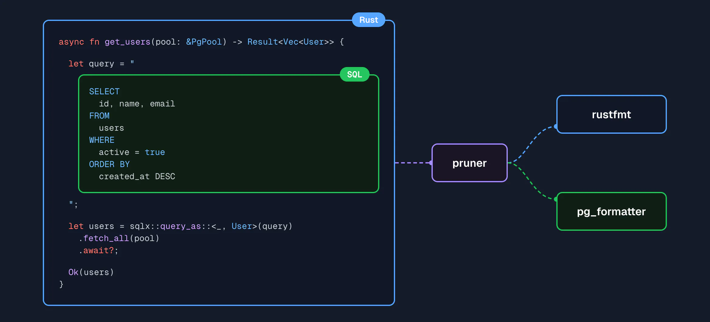

<div align="center">
  <h1>Pruner</h1>
  <p>
    A language-agnostic, TreeSitter-powered formatter for your code.
  </p>

</div>

## What

Pruner is a language and editor agnostic formatter which allows encapsulating all the formatting rules of your project
behind a shared, re-usable piece of config. It is designed in such a way as to allow leveraging all the existing,
language-specific formatter tools you are already using while also adding additional formatting capabilities.

Often times real-world source code contains multiple embedded languages, while formatters are typically very
language-specific and only operate on the root document - treating these embedded language regions as opaque strings.
Pruner uses Tree-Sitter to parse and understand source code files containing embedded languages, and can format those
embedded regions using their native formatting toolchain.



This effectively allows you to utilize a languages' native ecosystem for formatting across language barriers. This would
be in contrast to, for example, trying to build a single formatter which knows how to format all languages - an
impractical goal.

The goal is not to re-implement individual formatters for each language, but rather to define how to compose, configure,
and execute them.

In addition to being able to call out to existing language formatters, Pruner can also be extended using WASM-compiled
plugins. This allows encapsulating project/organization specific formatting rules, or writing brand new language
formatters in any language that can compile to WASM.

## Index

- **[What](#what)**
- **[Installation](#installation)**
- **[Configuration](#configuration)**
- **[Language Injections](#language-injections)**
- **[Plugins](#plugins)**
  - **[Official Plugins](#official-plugins)**
  - **[Community Plugins](#community-plugins)**
  - **[Authoring Plugins](#authoring-plugins)**
    - **[Rust Guide](./docs/writing-plugins.md)**

## Installation

### Homebrew

```bash
brew install pruner-formatter/tap/pruner
```

### Binaries

The binaries are also available on every Github release. Check the latest releases to find a binary for your platform.

## How to use it

Pruner reads from stdin and writes to stdout.

```bash
cat hello.md | pruner format --lang markdown > hello.md
```

Run `--help` for more information.

## Configuration

Configuration is defined in `toml` and can be provided in the following ways:

- A `pruner.toml` file at or in a parent of the current working directory
- A user-level config file placed at `$XDG_CONFIG_HOME/pruner/config.toml`. This will be merged with project-level
  config files
- A config file specified through the `--config` flag passed when calling `format`. If specified, this will be the
  _only_ config used.

Example `config.toml`:

```toml
# Search paths for tree-sitter injection queries
#
# This is not required if you don't care about formatting embedded languages
query_paths = ["queries"]

# Here you can define repository URLs containing tree-sitter language grammars. These repos will be cloned down,
# compiled, and loaded when formatting these languages.
#
# This is not required if you don't care about formatting embedded languages
[grammars]
clojure = "https://github.com/sogaiu/tree-sitter-clojure"
markdown = "https://github.com/tree-sitter-grammars/tree-sitter-markdown"
sql = { url = "https://github.com/derekstride/tree-sitter-sql", rev = "gh-pages" }

# Named formatters which can be executed by Pruner. The tools referenced by `cmd` will need to be installed and
# available on your $PATH
[formatters]
prettier = { cmd = "prettier", args = ["--prose-wrap=always", "--print-width=$textwidth",
  "--parser=$language"] }

pg_format = { cmd = "pg_format", args = [
  "--spaces=2",
  "--wrap-limit=$textwidth",
  "-",
] }

# Wasm plugins to be loaded by pruner. This should be a URI pointing to a compiled .wasm binary implementing the
# pruner/plugin-api.
[plugins]
trim_newlines = "https://github.com/pruner-formatter/plugin-trim-newlines/releases/download/v0.1.0/plugin.wasm"
plugin_b = { url = "file:///path/to/plugin.wasm" }

# This section contains a mapping of language name -> formatters. When the relevant language is to be formatted, pruner
# will execute the formatters specified here in order.
#
# These can be named [formatters] or [plugins]
[languages]
markdown = ["prettier", "trim_newlines"]
sql = ["pg_format", "trim_newlines", "plugin_b"]

# Profiles are partial config overrides which can be applied selectively at runtime. More on this below.
[profiles]
```

## Language Injections

Pruner uses tree-sitter injection queries (`injections.scm`) to find regions in your document containing other embedded
languages. These are typically shipped alongside grammars and are automatically included when loading the grammar for
your language.

A good example is markdown which contains embedded languages inside code blocks. The official markdown grammar includes
injection queries which describe these embedded languages and so Pruner automatically knows how to format these sections
(provided you have the relevant formatters for the language configured, of course).

You are also free to (and encouraged to!) write your own language injections to support formatting embedded languages
not defined in an official grammar.

Pruner loads language injection queries from the configured query 'search paths' by resolving
`<search-path>/<language>/injections.scm`. As an example, to add injections queries for Rust you would need to place a
file at `./queries/rust/injections.scm` and add `"./queries"` to the configured set of `query_paths`.

Read **[this short guide](./docs/writing-injections.md)** for a more practical example on how to write your own queries.

## Plugins

The pruner plugin API is defined as a [WIT interface](https://component-model.bytecodealliance.org/design/wit.html) and
you can find the definition [here](./wit/world.wit), or you can download the WIT files from the releases page.

Pruner plugins are compiled WASM components and can be loaded from disk or from a remote URL. By using WASM Pruner
allows plugin authors to write plugins in any language of their choosing so long as it can be compiled to a WASM
component. See [here](https://component-model.bytecodealliance.org/language-support.html) for a list of known supported
languages.

### Official Plugins

- **[trim-newlines](https://github.com/pruner-formatter/plugin-trim-newlines)** - Trim leading/trailing newlines from
  any language
- **[clojure-comment-formatter](https://github.com/pruner-formatter/plugin-clojure-comment-formatter)** - Format and
  align Clojure comments to the node they correspond to.

### Community Plugins

Feel free to open a PR contributing your own plugin(s)!

### Authoring Plugins

See the **[writing plugins](./docs/writing-plugins.md)** guide for a reference on how to build a plugin in Rust, or go
check out one of the above plugins for a reference.

## Acknowledgements

Thanks to

- [stevearc/conform.nvim](https://github.com/stevearc/conform.nvim/) For being the driving inspiration for Pruners
  config and approach to formatter composition.
